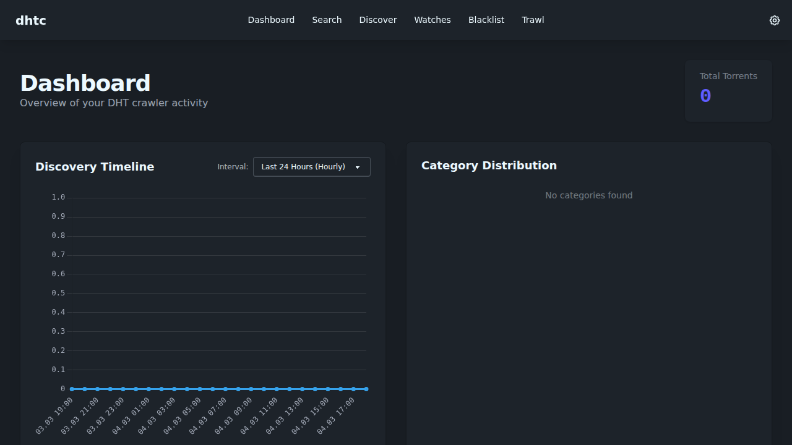
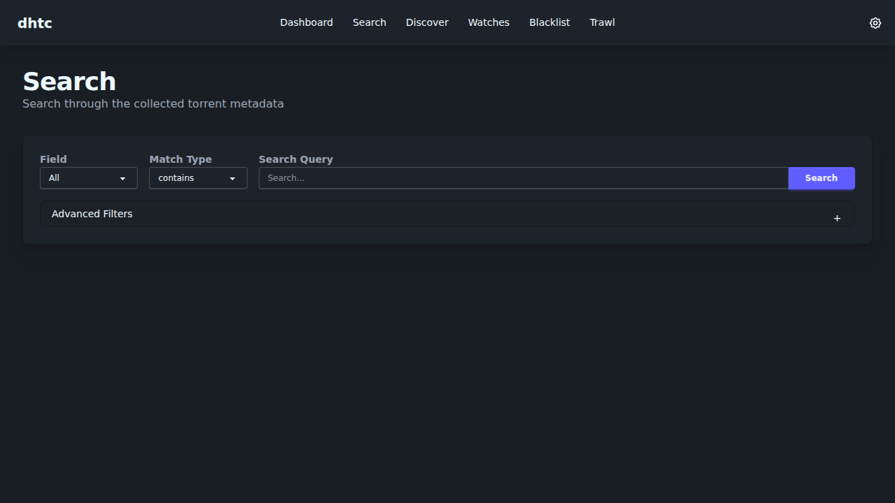
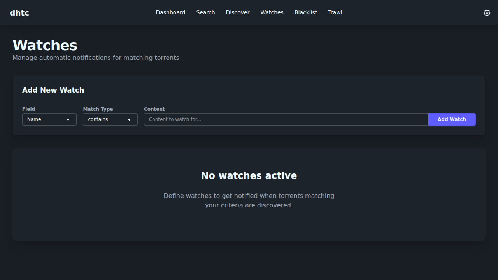
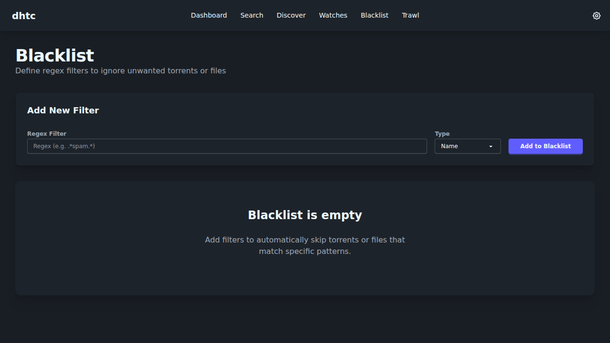
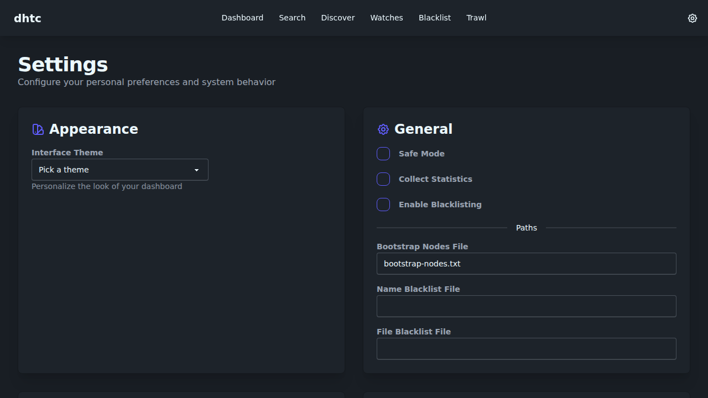
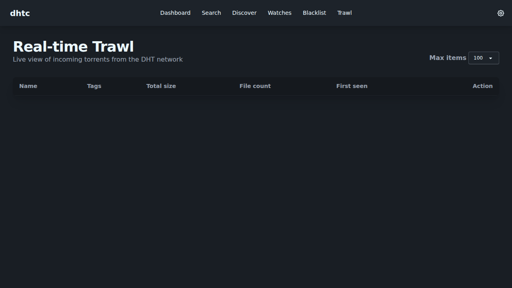

# 🕸️ dhtc

[](https://go.dev/)
[](https://github.com/nbdy/dhtc/actions)
[](https://github.com/nbdy/dhtc)

**Build your own private torrent search engine.**
`dhtc` is a high-performance DHT crawler that indexes the BitTorrent network in real-time and provides a beautiful web interface to explore, search, and manage your findings.

> [!NOTE]
> **This project is currently in maintenance mode.**
> While new features aren't actively being added, the project remains stable, fully functional, and ready for deployment.

---

### ✨ Features

#### 🔍 Discovery & Search
- **Real-time DHT Crawling**: Indexes the network using modern protocols (BEP 51, IPv6, PEX, BitTorrent v2).
- **Live "Trawl" View**: Watch torrents fly in via WebSockets with interactive elements.
- **Discover & Search**: Explore the latest findings or search the entire database with sortable results.
- **Blacklisting**: Keep your database clean with Regex-based name and file filters.

#### 🎨 User Experience
- **Modern UI**: Powered by **Tailwind CSS 4** and **DaisyUI 5** for a sleek, responsive experience.
- **20+ Themes**: Switch between dozens of themes (Light, Dark, Cyberpunk, Retro, and more) on the fly.
- **Dashboard & Stats**: Visualize network activity and indexing progress with built-in charts.

#### 🔔 Notifications & Automation
- **Smart Watches**: Set up filters and get notified the moment a matching torrent is discovered.
- **Multi-channel Alerts**: Integrated support for **Telegram**, **Discord**, **Slack**, and **Gotify**.
- **One-Click Downloads**: Send magnets directly to **Transmission**, **Aria2**, **Deluge**, or **qBittorrent**.

#### 🛠️ Technical Excellence
- **Database Flexibility**: Choose your backend—supports **PostgreSQL**, **MySQL**, **SQLite** (via GORM), or **CloverDB**.
- **REST API**: Simple endpoints for integration with third-party tools.
- **Secure by Design**: Optional Basic Auth support to protect your web interface.
- **Multiplatform**: Runs anywhere Go or Docker can run.
- **Docker Ready**: Deploy anywhere in seconds with the official Docker Compose setup.

---

### 📸 Screenshots

| Dashboard | Search |
|-----------|--------|
|  |  |

| Discover | Watches |
|----------|---------|
|  |  |

| Blacklist | Settings |
|-----------|----------|
|  |  |

| Trawl |
|-------|
|  |

---

### 🚀 Getting Started

#### Run with Docker (Recommended)
The fastest way to get up and running is using Docker Compose:
```shell
docker compose up -d
```
Your search engine will be waiting for you at [http://localhost:4200](http://localhost:4200).

#### Run Locally
Ensure you have [Go 1.24+](https://go.dev/dl/) installed, then:
```shell
go run cmd/dhtc/main.go
```
